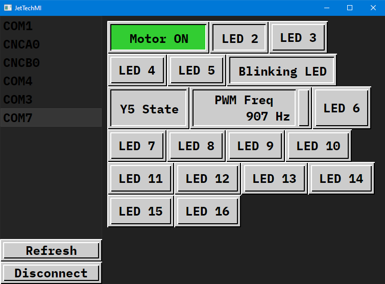

# JetTechMI
A library for designing the interface for Human Machine Interface displays.

This library is incredibly WIP at the moment. If you have any feedback or criticism for the app, that would be appreciate! Also feel free to contribute, if you would like to. You can see the TODO list near the bottom


*Motor ON button changes its text based on the visible pressed state, using Avalonia styles only. Other buttons are visibly pressed only by the ReadVariable property. The numeric entry with the PWM Freq text has a ReadVariable for a short number*

# Building

Clone the project using the command
```
git clone --recursive https://github.com/AngryCarrot789/JetTechMI
```

You should then be able to build and run without problem. If you want to build and upload the project to, for example, a raspberry PI, you can follow these commands. You will need 2 terminals open
```
On Raspberry PI:
  SSH into it:
    ssh <username>@<address>
        
  Delete any existing old app version files:
    rm /home/<username>/JetTechMI/* -r

On windows:
  CD into the project directory and run build command:
    dotnet build -c Debug -r linux-arm64 -p:PublishReadyToRun=true -p:PublishSingleFile=true -p:PublishTrimmed=true --self-contained true -p:IncludeNativeLibrariesForSelfExtract=true
  
  Copy files from windows to raspberry pi via SCP:
    scp -r bin\Debug\net8.0\linux-arm64\* <username>@<address>:/home/<username>/BlueberryBenchSupply

On Raspberry PI:
  Setup permissions for application file
    sudo chmod +x /home/<username>/BlueberryBenchSupply/BlueberryBenchSupply
  
  Run the executable with --drm parameter for avalonia:
    /home/<username>/BlueberryBenchSupply/BlueberryBenchSupply --drm

For running the app when the Rasp PI boots, this is a bodged workaround but it works:
Open the bash profile file:
    sudo nano ~/.bash_profile

Then add this line:
/home/<username>/BlueberryBenchSupply/BlueberryBenchSupply --drm

```

## Principles
The idea was that for each control there would be an instance of `IJtControlData` which would be used
to implement the updating and batched data requests of a specific control. The `JtButton` class is one example.
You shouldn't necessarily need to access code behind; you'd just need to have code somewhere to connect to your PLC
and register it with the `JetTechContext` global instance.

Controls are added to and removed from the `JtControlManager` global instance, which is what deals with the update loop
and also deals with the batched update system.

When using a page system, it's important to unregister controls that are no longer visible. 
I will try and work on an automatic system for this

## Designing a UI
For buttons, use `JtButton`. It has a `ReadVariable` (which determines the visible pressed state), a `WriteVariable` (which is used 
to write the physical pressed state) and the `EnablingVariable` which is what either enabled or disabled the button (none present means always enabled).
There's also the ButtonMode which is what lets the button behave as a Set, Reset, Toggle or Push button (rather than having separate controls for each)


## Contributing
Feel free to contribute whatever you want if you think it'll make the editor better!

# Licence
All source files in JetTechMI are under the GNU General Public License version 3.0 or later (GPL v3.0+).
JetTechMI uses a fork of `HslCommunication-Community` which is a submodule. 
This project also uses libraries that have other licences, such as MIT/LGPL licences.

If any source file is missing a copyright notice, it is assumed to be licenced under the same
licence as JetTechMI
